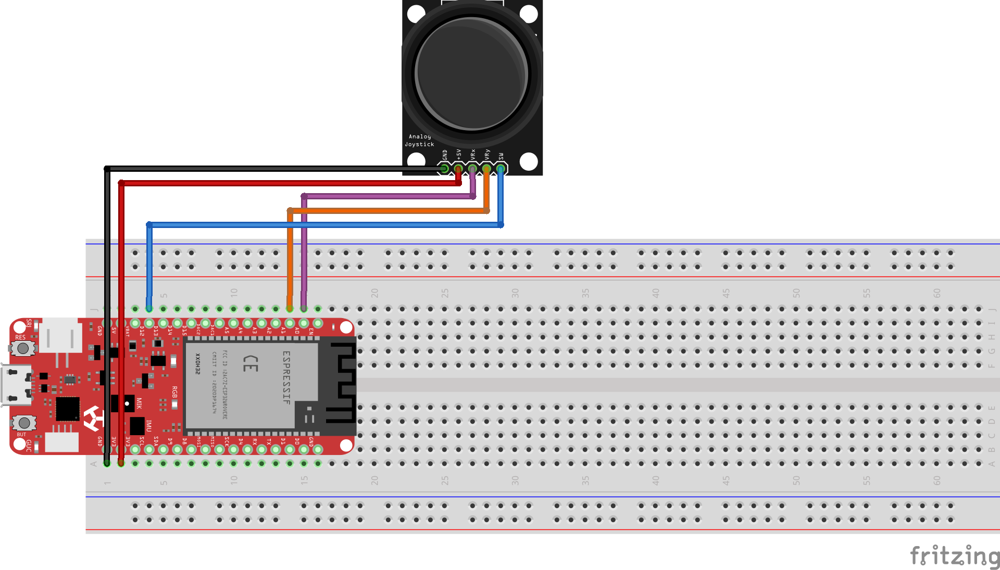

# 📯 Deneyap Kart Web Serial
Deneyap Kart'tan alınan verilerin Web Serial API ile client side JavaScript'e gönderilmesi örnek proje.

https://user-images.githubusercontent.com/85290165/190926835-60c269b9-ec58-45cc-bcfe-a17c235129dc.mp4

## Hızlı Başlangıç
* Repo'yu klonlayın.
```
$ git clone https://github.com/orhanemree/deneyapkart-webserial.git
$ cd deneyapkart-webserial
```
* `deneyapkart-webserial.ino` dosyasını joystick bağlantısı yapılmış Deneyap Kart'ınıza yükleyin.
* `index.html` dosyasını tarayıcınızda açın.
```
# python kullananlar için
$ python -m http.server 8080
```
* Joystick butonuna basılı tutarak sağa-sola yukarı-aşağı yaptığınız her hareket sayfadaki kutuyu da hareket ettirecektir. 

## Bağlantı Şeması


## Referanslar
* [MDN Web Serial Reference](https://developer.mozilla.org/en-US/docs/Web/API/Web_Serial_API)

## Lisans
* [MIT Lisansı](LICENSE).
